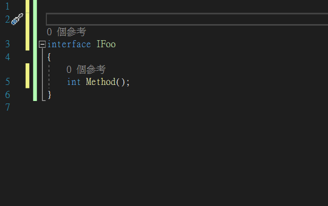

  
## Introduction  
This is an extension for **Visual Studio 2019**, a syntax checking aid when developing projects with **[Regulus.Remote](https://github.com/jiowchern/Regulus)**.  

## Usage
Add the ```Regulus.Remote.Attributes.SyntaxHelper``` attribute to the protocol interface.
```csharp
namespace Demo
{
    [Regulus.Remote.Attributes.SyntaxHelper]
    public interface IFoo
    {
    }
}
```

